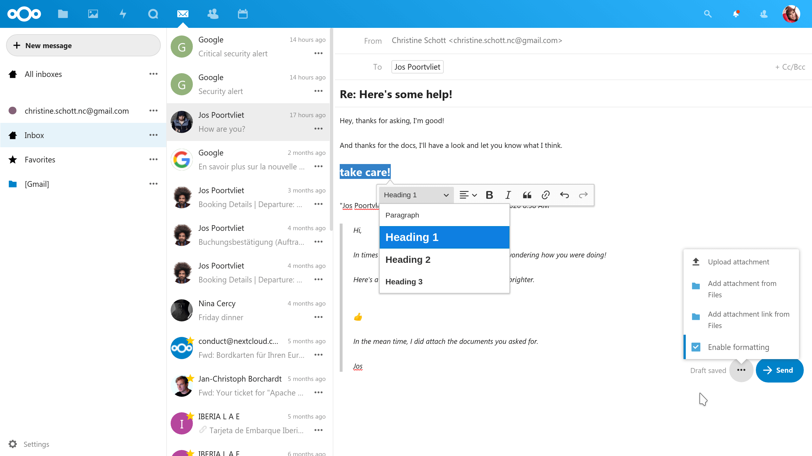

# Nextcloud Mail


[](https://codecov.io/gh/nextcloud/mail)
[](https://dependabot.com)

**💌 A mail app for [Nextcloud](https://nextcloud.com)**




## Why is this so awesome?

* **🚀 Integration with other Nextcloud apps!** Currently Contacts, Calendar & Files – more to come.
* **📥 Multiple mail accounts!** Personal and company account? No problem, and a nice unified inbox. Connect any IMAP account.
* **🔒 Send & receive encrypted mails!** Using the great [Mailvelope](https://mailvelope.com) browser extension.
* **📑 Message threads!** Now we have proper grouping of message threads.
* **🗄️ Mailbox management!** You can edit, delete, add submailboxes and more.
* **🙈 We’re not reinventing the wheel!** Based on the great [Horde](http://horde.org) libraries.
* **📬 Want to host your own mail server?** We don’t have to reimplement this as you could set up [Mail-in-a-Box](https://mailinabox.email)!

If you experience any issues or have any suggestions for improvement, use the [issue tracker](https://github.com/nextcloud/mail/issues). Please follow the [issue template chooser](https://github.com/nextcloud/mail/issues/new/choose) so we get the info needed to debug and fix the problem. Thanks!

## Installation

The app is distributed through the [app store](https://apps.nextcloud.com/apps/mail) and you can install it [right from your Nextcloud installation](https://docs.nextcloud.com/server/stable/admin_manual/apps_management.html).

Release tarballs are hosted at https://github.com/nextcloud-releases/mail/releases.

## Get on board
For new contributors, please check out [ContributingToNextcloudIntroductoryWorkshop](https://github.com/sleepypioneer/ContributingToNextcloudIntroductoryWorkshop)

## Development setup

Just clone this repo into your apps directory ([Nextcloud server](https://github.com/nextcloud/server#running-master-checkouts) installation needed). Additionally, [npm](https://www.npmjs.com/) to fetch [Node.js](https://nodejs.org/en/download/package-manager/) is needed for installing JavaScript dependencies
and [composer](https://getcomposer.org/download/) is needed for dependency management in PHP.

Once npm and Node.js are installed, PHP and JavaScript dependencies can be installed by running:
```bash
make dev-setup
```

We are also available on [our public Mail development chat](https://cloud.nextcloud.com/call/89474m7g), if you want to join the development discussion. Please report bugs [here on Github](https://github.com/nextcloud/mail/issues/new/choose) and open any questions and support tickets at [the community forum](https://help.nextcloud.com/c/apps/mail).

## Documentation

Need help? Check out our documentation. It's split into three parts.
* [Admin documentation](doc/admin.md) (installation, configuration, troubleshooting)
* [Developer documentation](doc/developer.md) (developer setup, nightly builds)
* [User documentation](doc/user.md) (usage, keyboard shortcuts)
