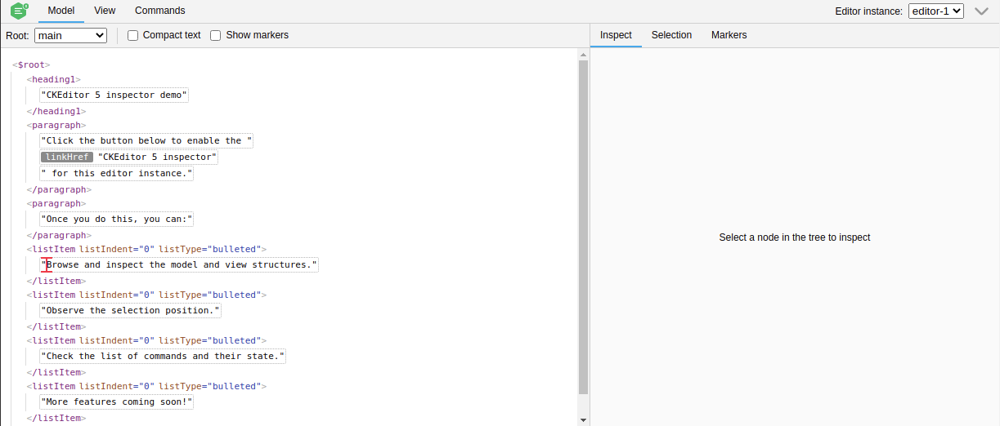
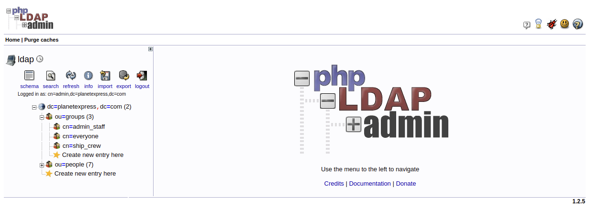
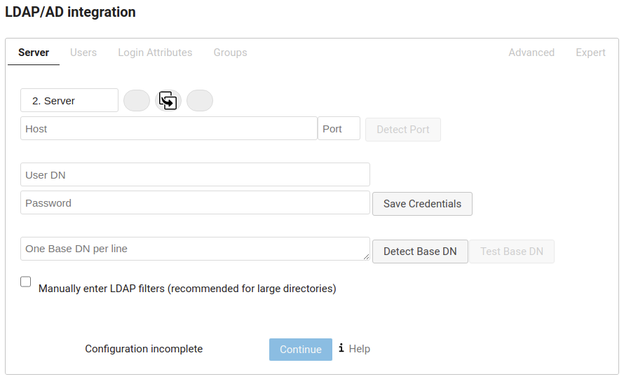
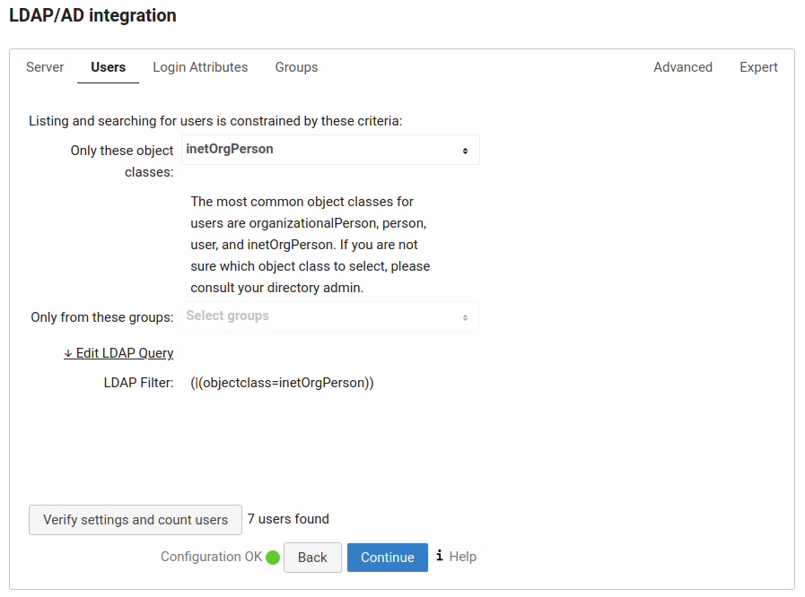
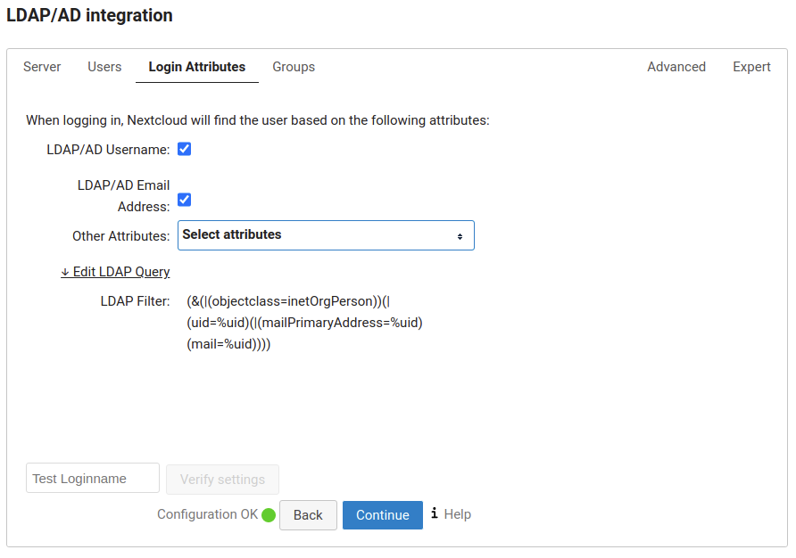
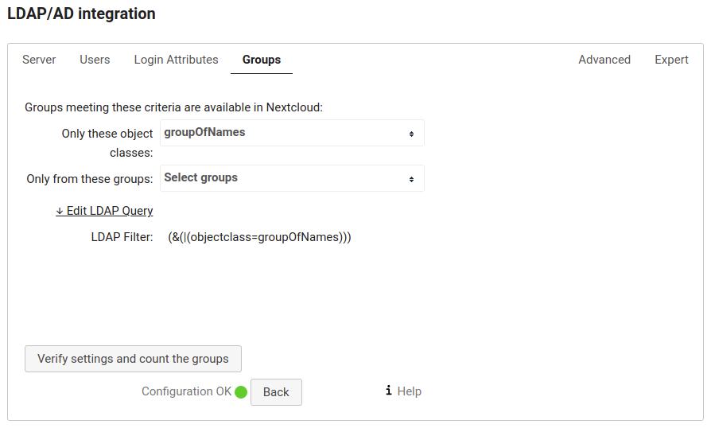
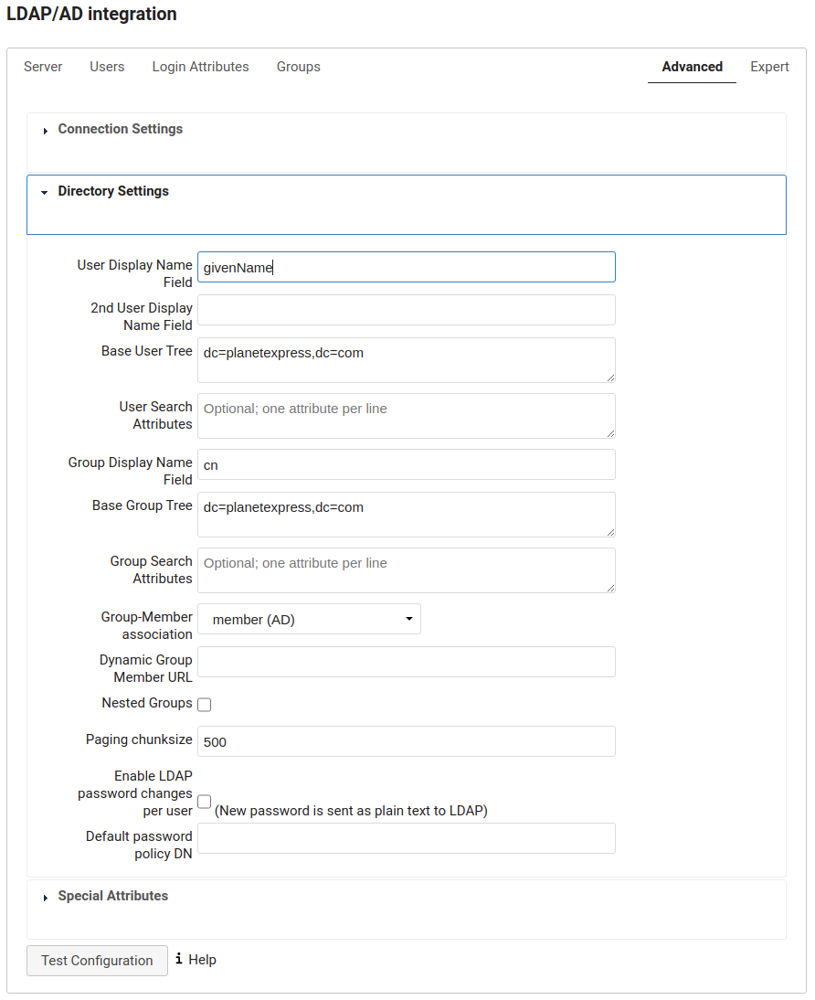
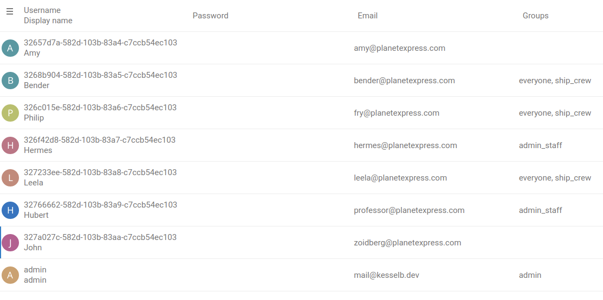
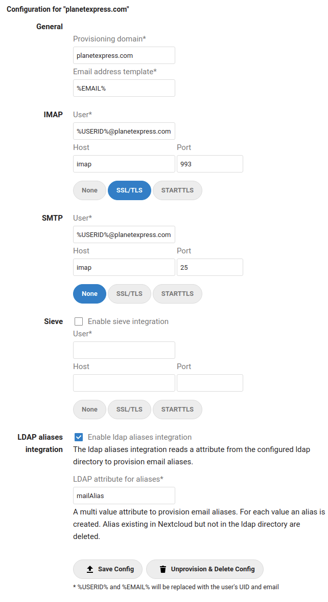

# Nextcloud Mail Developer Documentation

## Resetting the app
Connect to your database and run the following commands (`oc_` is the default table prefix):
```sql
DELETE FROM oc_appconfig WHERE appid = 'mail';
DELETE FROM oc_migrations WHERE app = 'mail';
DROP TABLE oc_mail_accounts;
DROP TABLE oc_mail_aliases;
DROP TABLE oc_mail_coll_addresses;
DROP TABLE oc_mail_attachments;
DROP TABLE oc_mail_mailboxes;
DROP TABLE oc_mail_messages;
DROP TABLE oc_mail_recipients;
DROP TABLE oc_mail_classifiers;
DROP TABLE oc_mail_trusted_senders;
DROP TABLE oc_mail_tags;
DROP TABLE oc_mail_message_tags;
DROP TABLE oc_mail_provisionings;
DROP TABLE oc_mail_local_messages;
```

## Enable CKEditor Inspector



- `npm install --save-dev @ckeditor/ckeditor5-inspector`.
- Open `src/components/TextEditor.vue` (CKEditor is initialized in this component).
- Import the module `import CKEditorInspector from '@ckeditor/ckeditor5-inspector';`
- Add `CKEditorInspector.attach( editor );` to `onEditorReady`

Documentation: https://ckeditor.com/docs/ckeditor5/latest/framework/guides/development-tools.html

## Testing LDAP aliases provisioning

Testing the ldap aliases provisioning requires:

1. LDAP service configured in Nextcloud
2. IMAP service using LDAP for authentication
3. A provisioning configuration for Mail

### LDAP service configured in Nextcloud

The fastest way to setup Nextcloud with LDAP is https://github.com/juliushaertl/nextcloud-docker-dev.

It's still possible to integrate a ldap service into your own
development setup with docker-compose.

```
ldap:
  image: osixia/openldap:1.5.0
  command: --copy-service --loglevel debug
  ports:
    - 50003:389
  volumes:
    - ./ldap:/container/service/slapd/assets/config/bootstrap/ldif/custom
  environment:
    LDAP_DOMAIN: planetexpress.com
	LDAP_BASE_DN: dc=planetexpress,dc=com

ldapadmin:
  image: osixia/phpldapadmin:0.9.0
  ports:
    - 50004:443
  environment:
    - PHPLDAPADMIN_LDAP_HOSTS=ldap
```

To have sample users we are using https://github.com/juliushaertl/nextcloud-docker-dev/tree/master/data/ldap.
- Download the directory and save it in the same directory as docker-compose.yml.
- Delete 99_others.ldif (otherwise you have a lot of additional test users).
- Adjust the port mapping for your use case if necessary.

Run docker-compose to start ldap and ldapadmin.
Visit ldapadmin at http://localhost:50004 (or whatever port you configured) and try to login with

- user: cn=admin,dc=planetexpress,dc=com
- password: admin



Next step is to configure our LDAP service in Nextcloud.
- Login as administrator
- Go to apps and enable "LDAP user and group backend"
- Go to settings -> LDAP/AD integration



- Host: the address of your LDAP server
- Port: 389 mostly
- User DN: cn=admin,dc=planetexpress,dc=com
- Password: admin
- One Base DN per line: dc=planetexpress,dc=com

Click Test Base DN to test the configuration.



- Only these object classes: inetOrgPerson

Click Verfiy settings and count users.



- Check LDAP/AD Username
- Check LDAP/AD Email Address



- Only these object classes: groupOfNames



- User Display Name Field: givenName

### IMAP service using LDAP for authentication

In a production environment we would configure our IMAP service
to authenticate against the LDAP service. For our testing scenario it's
sufficient to configure some LDAP accounts on the IMAP service.

```
imap:
  image: christophwurst/imap-devel:latest
  ports:
    - "25:25"
    - "143:143"
    - "993:993"
    - "4190:4190"
  environment:
    - MAILNAME=mail.domain.tld
    - MAIL_ACCOUNTS=admin@test.local,password 3268b904-582d-103b-83a5-c7ccb54ec103@planetexpress.com,bender 32657d7a-582d-103b-83a4-c7ccb54ec103@planetexpress.com,amy
```

Extend our docker-compose.yml and add the imap test image.
Use the MAIL_ACCOUNTS environment variable to create test accounts for IMAP.




3268b904-582d-103b-83a5-c7ccb54ec103@planetexpress.com is the username for
the user in the LDAP directory. The username might be different on your setup.
Please lookup the right values in the Nextcloud user management.

To create a IMAP account for Amy and Bender add to MAIL_ACCOUNTS.

`32657d7a-582d-103b-83a4-c7ccb54ec103@planetexpress.com,amy 3268b904-582d-103b-83a5-c7ccb54ec103@planetexpress.com,bender`

The password is (for our sample data) the display name in lowercase.
Note that accounts are seperated by a space.

### A provisioning configuration for Mail



The above configuration will query the mailAlias attribute for each user
and use it to create and delete aliases.

Our sample data for LDAP does not contain mailAlias. To add one or more mailAliases
to a user:
- Visit ldapadmin
- Expand dc=planetexpress,dc=com
- Expand ou=people
- Pick a user (e.g Bender)
- Look for objectClass -> Click add value -> Select PostfixBookMailAccount -> Click Add new ObjectClass
- Click Add new attribute -> Select mailAlias -> Enter rodriquez@planetexpress.com -> Press Enter -> Click Update Object

Now login to Nextcloud as Bender and go to Mail. See rodriquez@planetexpress.com
as Alias in the Account settings for the provisoned mail account.

## Generate self signed S/MIME CA and user certificates

You may use the following script to generate a CA and multiple user certificates. It has to be invoked with 2 parameters: the user name and the domain.

**Example:** Run the following command to generate a certificate for user@imap.localhost:
```sh
sh gen-smime-cert.sh user imap.localhost
```

You will be prompted for a password that is used to encrypt the PKCS12 (.p12) file.

The certificate and key will be placed in the current directory:
- `user@imap.localhost.crt`: PEM encoded certificate
- `user@imap.localhost.key`: PEM encoded private key
- `user@imap.localhost.crt`: PKCS12 encoded certificate and private key for usage in desktop clients

### gen-smime-cert.sh

```sh
#!/bin/sh

# Generate an S/MIME certificate for user@domain.

usage () {
    echo "Usage: $(basename "$0") <user> <domain>"
    echo 'This will generate an S/MIME certificate for user@domain.'
    echo 'The CA certificate is generated automatically if not present (ca.key, ca.crt).'
}

[ -z "$2" ] && usage && exit 1

common_name="$1"
email_address="$common_name"@"$2"

# Generate CA key and certificate if not present
if [ ! -f ca.key ] || [ ! -f ca.crt ]; then
    openssl genrsa -out ca.key 4096
    openssl req \
        -new \
        -x509 \
        -key ca.key \
        -out ca.crt \
        -days 3650 \
        -subj "/CN=0 S\\/MIME CA"
fi

# Generate client certificate
openssl genrsa -out "$email_address".key 4096
openssl req \
    -new \
    -x509 \
    -key "$email_address".key \
    -out "$email_address".crt \
    -CA ca.crt \
    -CAkey ca.key \
    -days 365 \
    -subj "/CN=$common_name/emailAddress=$email_address" \
    -set_serial 0x"$(openssl rand -hex 16)" \
    -addext basicConstraints=critical,CA:FALSE \
    -addext keyUsage=critical,digitalSignature,keyEncipherment \
    -addext "subjectAltName=email:$email_address"

# Export an encrypted PKCS12 (.p12) file
openssl pkcs12 \
    -export \
    -in "$email_address".crt \
    -inkey "$email_address".key \
    -out "$email_address".p12
```
